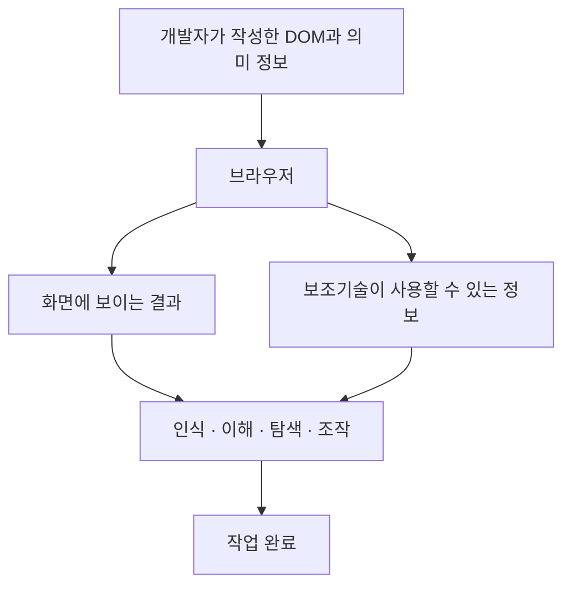
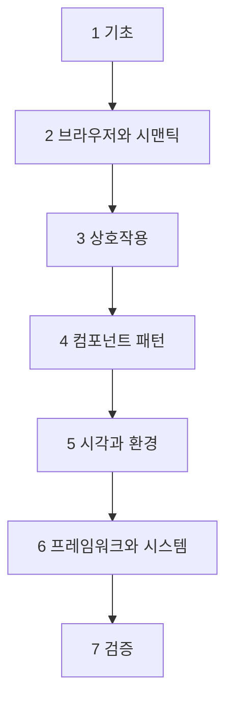

# 시작하기

웹접근성(Web Accessibility)을 처음 들을 때 가장 흔히 따라오는 정의는 이것이다.

```text
웹접근성 = 스크린 리더 사용자를 위한 대응
```

이 정의는 접근성의 아주 일부만 남기고 나머지를 지운다.
이 정의만 들고 있으면 접근성은 "개발이 끝난 뒤 QA가 확인하는 항목"이 되고,
`aria-label`을 몇 개 붙이는 작업으로 축소된다.

W3C의 Web Accessibility Initiative(WAI)는 웹접근성을 다음과 같이 정의한다.

> **핵심:** 웹접근성은 장애가 있는 사람이 웹사이트, 도구, 기술을 사용할 수 있도록
> 설계하고 개발하는 것이다.

여기서 "사용할 수 있다"는 말이 무엇을 뜻하는지가 이 챕터의 주제다.
WAI는 이를 콘텐츠를 **동등하게 인식하고, 이해하고, 탐색하고, 상호작용할 수 있는 것**으로 풀어 쓴다.

이 챕터는 웹접근성 트랙의 orientation이다.
따라서 WCAG의 개별 Success Criteria, ARIA role 목록, 접근성 트리 생성 알고리즘,
focus 관리 구현 같은 내용은 여기서 다루지 않는다.
대신 "각 개념이 전체 그림에서 어디에 있는가"와 "왜 프론트엔드 코드가 그 결과를 만드는가"에 집중한다.

## 웹접근성이란?

### 사용자가 작업을 끝내기까지

사용자는 화면을 감상하려고 웹에 오지 않는다. 무언가를 끝내려고 온다.
회원가입을 하고, 주문을 취소하고, 예약을 변경한다.
그 과정을 단계로 펼치면 다음과 같다.

```text
사용자
  ↓
콘텐츠를 인식한다        (보이거나, 들리거나, 읽힌다)
  ↓
UI의 의미를 이해한다     (이것이 버튼인지 제목인지 안다)
  ↓
탐색한다                 (원하는 위치로 이동한다)
  ↓
조작한다                 (누르고, 입력하고, 선택한다)
  ↓
상태와 오류를 이해한다    (무엇이 잘못됐고 어떻게 고치는지 안다)
  ↓
작업을 완료한다
```

이 단계 중 **어느 하나라도 막히면 작업은 끝나지 않는다**.
접근성은 사용자의 능력이나 사용하는 기술 때문에 이 흐름에 불필요한 장벽이 생기지 않도록 만드는 일이다.

여기서 중요한 것은 장벽이 마지막에 갑자기 생기지 않는다는 점이다.
"이해한다" 단계가 막히면 뒤의 모든 단계가 함께 막힌다.
그래서 접근성 문제는 대개 마지막 단계가 아니라 구조에서 시작된다.

### 접근성이 아닌 것

먼저 좁은 정의부터 정리한다.

```text
접근성 ≠ 스크린 리더 대응만
접근성 ≠ aria-* 속성을 추가하는 일
접근성 ≠ 색상 대비 검사만
접근성 ≠ 출시 직전 QA 체크리스트
접근성 ≠ 장애가 있는 사용자를 위한 별도 화면
```

마지막 항목은 특히 중요하다.
접근성의 목표는 분리된 대체 화면을 만드는 것이 아니라,
**하나의 제품을 여러 방식으로 사용할 수 있게** 만드는 것이다.

### 접근성이 실제로 포괄하는 범위

같은 질문을 넓게 보면 접근성은 다음이 함께 맞아야 성립한다.

```text
HTML 구조와 의미
+ 키보드 조작
+ 포커스의 위치와 순서
+ 요소의 이름(name)과 상태(state)
+ 시각 정보 (대비 · 크기 · 확대)
+ 입력과 오류 안내
+ 모션과 시간 제약
+ 보조기술(Assistive Technology) 호환성
+ 예측 가능한 상호작용
```

이 목록의 각 항목은 이 트랙의 개별 챕터가 된다.
지금 필요한 것은 각 항목의 구현 방법이 아니라, **접근성이 이 전부의 합**이라는 사실이다.

## 접근성은 누구를 위한 것인가?

### 능력의 분류가 아니라 장벽의 문제

접근성을 배울 때 흔히 "장애 유형 표"부터 외우려고 한다.
그러나 WAI는 사람을 의학적 분류로 나누기보다 **기능적으로 다양한 필요**를 고려하라고 명시한다.
같은 진단명을 가진 두 사람이 완전히 다른 방식으로 웹을 사용할 수 있기 때문이다.

그래서 이 트랙은 다음 관계로 접근성을 본다.

```text
사용자의 능력
  +
사용 환경        (밝기 · 소음 · 이동 중 · 네트워크)
  +
입력과 출력 방식  (키보드 · 스위치 · 음성 · 확대 · 스크린 리더)
  +
인터페이스 설계
        ↓
   장벽(Barrier)  또는  접근 가능한 경험
```

장벽은 사람에게 있는 것이 아니라 이 조합에서 생긴다.
그리고 네 항목 중 프론트엔드가 직접 결정하는 것은 마지막 항목이다.

### 어떤 능력과 어떤 장벽이 있는가

WAI는 시각, 청각, 인지·학습, 신체(운동), 언어(발화) 능력을 폭넓게 다루고,
여기에 복합적인 장애, 노화에 따른 능력 변화, 일시적인 손상, 상황적인 제약을 함께 설명한다.

| 사용 상황                      | 생길 수 있는 장벽                                  |
| ------------------------------ | -------------------------------------------------- |
| 화면을 보지 않고 소리로 듣는다 | 이미지와 아이콘에 대체 텍스트가 없다               |
| 화면을 크게 확대해서 본다      | 확대하면 레이아웃이 겹치거나 잘린다                |
| 마우스 없이 키보드만 사용한다  | 포커스가 어디 있는지 보이지 않는다                 |
| 오디오를 들을 수 없다          | 영상에 자막이나 대본이 없다                        |
| 손 떨림으로 정밀 조작이 어렵다 | 클릭 대상이 너무 작고 서로 붙어 있다               |
| 복잡한 절차를 기억하기 어렵다  | 오류 메시지가 무엇을 고쳐야 하는지 알려주지 않는다 |
| 팔을 다쳐 한 손만 쓴다         | 동시에 두 손이 필요한 조작만 제공된다              |
| 밝은 햇빛 아래에서 본다        | 대비가 낮아 글자가 읽히지 않는다                   |

앞의 여섯 줄은 지속적인 장애와 관련된 상황이고, 뒤의 두 줄은 일시적·상황적 제약이다.
표에서 눈여겨볼 점은 **장벽의 내용이 서로 겹친다**는 것이다.
낮은 대비는 저시력 사용자에게도, 햇빛 아래의 사용자에게도 같은 방식으로 문제가 된다.

### 우선순위를 뒤집지 않기

이 겹침 때문에 접근성을 이렇게 요약하는 설명을 자주 본다.

```text
접근성은 사실 장애인보다 모두를 위한 것이다.
```

이 문장은 순서를 뒤집는다. 정확한 관계는 다음과 같다.

```text
Primary purpose
장애가 있는 사용자가 웹을 동등하게 사용할 수 있게 한다.

        ↓

Broader benefit
그 요구를 제대로 설계하면
다른 사용자와 다양한 사용 환경에도 이점이 생길 수 있다.
```

> **주의:** 두 번째가 첫 번째를 대체하지 않는다.
> "모두에게 좋으니까 하자"는 설득은 편리하지만,
> 그 논리만 남으면 다수에게 이득이 적어 보이는 요구는 곧 우선순위에서 밀린다.
> 접근성의 기준은 다수의 편익이 아니라 **동등한 사용**이다.

## 프론트엔드 개발자에게 접근성이 중요한 이유

### 접근성 정보는 프론트엔드 코드에서 나온다

접근성은 별도의 전문 부서가 마지막에 붙이는 레이어가 아니다.
사용자가 실제로 받는 정보는 프론트엔드가 작성한 마크업에서 출발한다.



지금 단계에서 기억할 것은 한 문장이다.

> **핵심:** 개발자가 작성한 DOM과 의미 정보는 브라우저가 해석하며,
> 그 해석 결과가 보조기술이 사용할 수 있는 정보를 결정한다.

브라우저가 이 정보를 어떤 구조로 만드는지는 이후 `브라우저 접근성 트리는 어떻게 만들어지는가?`에서 다룬다.
지금은 화면과 보조기술이 **같은 마크업에서 갈라져 나온다**는 사실만 잡아 두면 된다.

### 작은 선택이 만드는 차이

같은 화면처럼 보여도 브라우저가 이해하는 의미는 다를 수 있다.

#### 예제 A — 동작을 나타내는 요소

문제 상황: 저장 버튼을 만들어야 한다. 디자인상 `div`에 스타일을 입혀도 똑같아 보인다.

Before:

```html
<div class="btn" onclick="save()">저장</div>
```

문제 분석: 이 `div`는 브라우저에게 그냥 일반 컨테이너다.
키보드 Tab 순서에 들어가지 않고, Enter나 Space로 눌리지 않으며,
보조기술에게 "버튼"이라고 알려지지도 않는다.
마우스로는 정상 동작하므로 개발자 화면에서는 문제가 드러나지 않는다.

After:

```html
<button type="button">저장</button>
```

무엇이 달라졌는가: `button`을 쓰면 Tab으로 이동할 수 있고, Enter와 Space로 활성화되며,
"버튼"이라는 역할과 "저장"이라는 이름이 함께 전달된다.
이 동작을 위해 추가로 작성한 코드는 없다.

#### 예제 B — 입력 필드의 이름

문제 상황: 입력 칸 위에 별도 텍스트를 두지 않고 placeholder로만 안내하고 싶다.

Before:

```html
<input type="email" placeholder="이메일" />
```

문제 분석: placeholder는 값을 입력하면 사라지는 **힌트**이지 필드의 이름이 아니다.
입력 도중 무엇을 적는 칸이었는지 확인할 수 없고, 필드에 안정적인 이름이 남지 않는다.

After:

```html
<label for="email">이메일</label> <input id="email" type="email" />
```

무엇이 달라졌는가: `label`과 `input`이 연결되어 필드에 이름이 생기고,
라벨을 눌러도 입력 칸이 활성화되어 클릭 대상이 넓어진다.

> **검증:** 두 예제 모두 마우스를 치우고 Tab 키만으로 화면을 훑어보면 차이가 즉시 드러난다.
> 도구를 설치하기 전에 할 수 있는 가장 저렴한 확인 방법이다.

이 예제들의 목적은 구현 방법을 가르치는 것이 아니다.
**시각적으로 비슷한 UI라도 DOM의 의미와 기본 상호작용 계약이 다를 수 있다**는 것을 보여 주는 데 있다.
`div`에 버튼 동작을 직접 부여하는 방법은 이후 `ARIA는 언제 필요하고 언제 위험한가?`와
`키보드 접근성과 Focus Management`에서 다룬다.

## 접근성과 사용성의 차이

두 단어는 자주 같은 뜻처럼 쓰이지만, 던지는 질문이 다르다.

| 구분      | 접근성(Accessibility)        | 사용성(Usability)             |
| --------- | ---------------------------- | ----------------------------- |
| 핵심 질문 | 동등하게 사용할 수 있는가?   | 효과적이고 만족스럽게 쓰는가? |
| 초점      | 장벽의 제거                  | 경험의 품질                   |
| 대상 기준 | 장애가 있는 사용자           | 사용자 전반                   |
| 평가 방법 | 표준 적합성, 보조기술 테스트 | 사용자 조사, 과업 분석        |

두 영역은 겹친다. 명확한 오류 메시지는 두 관점 모두에서 좋다.
하지만 겹친다고 해서 하나가 다른 하나를 포함하지는 않는다.

```text
접근성                사용성
     \                /
      \              /
       사용자 경험(UX)
```

WAI는 사용성 연구와 실무가 장애가 있는 사용자의 필요를 충분히 다루지 못하는 경우가 많으며,
**사용성 절차와 사용자 참여만으로는 모든 접근성 문제를 해결할 수 없다**고 명시한다.

구체적인 예는 이렇다.

```text
마우스로 드래그하면 매우 편리한 커스텀 슬라이더
+
키보드로는 값을 바꿀 방법이 없음

→ 마우스 사용자 대상 사용성 평가는 좋게 나올 수 있지만
  키보드만 사용하는 사용자에게는 작업 자체가 불가능하다.
```

반대 방향도 성립한다.

> **주의:** 접근성 기준을 통과했다고 해서 좋은 UX가 자동으로 보장되지는 않는다.
> 모든 이미지에 대체 텍스트가 있더라도, 그 텍스트가 `이미지1`이라면
> 기술적으로는 존재하지만 실제로는 아무 정보도 전달하지 못한다.

## 접근성과 시맨틱 HTML의 관계

앞의 예제 A에서 `button`은 아무 추가 코드 없이 여러 동작을 제공했다.
이것이 시맨틱 HTML(Semantic HTML)이 접근성의 출발점인 이유다.

```text
시맨틱 HTML
      ↓
요소의 의미(역할)
기본 키보드 동작
label과 form 요소의 연결
문서 구조 (제목 · 목록 · 표 · 랜드마크)
      ↓
브라우저
      ↓
보조기술이 사용할 수 있는 정보
```

MDN은 이 관계를 "적절한 요소를 쓰는 것만으로 이 동작을 무료로 얻는다"고 설명한다.
반대로 말하면, 의미 없는 요소로 UI를 만들면 그 동작을 **전부 직접 다시 만들어야** 한다.

```html
<button type="button">메뉴 열기</button>
```

```html
<div>메뉴 열기</div>
```

아래 `div`를 위 `button`과 같은 수준으로 만들려면 역할, 포커스 가능 여부,
키보드 처리, 상태 전달을 모두 손으로 구현해야 하고, 그중 하나만 빠져도 장벽이 남는다.

> **핵심:** 접근성 구현은 ARIA를 추가하는 것보다 먼저,
> HTML이 이미 제공하는 의미와 동작을 올바르게 사용하는 데서 시작한다.

각 요소를 언제 어떻게 선택할지, ARIA가 필요한 경계는 어디인지는
`시맨틱 HTML은 왜 접근성의 기본인가?`와 `ARIA는 언제 필요하고 언제 위험한가?`에서 다룬다.

## 접근성과 디자인 시스템의 관계

### 화면 단위로 고치면 같은 문제가 반복된다

접근성을 화면별 QA 항목으로만 다루면 다음 순환이 생긴다.

```text
페이지 구현
→ 접근성 문제 발견
→ 해당 페이지에서 개별 수정
→ 다음 페이지에서 같은 문제 재발
```

문제의 원인은 페이지가 아니라 **재사용되는 UI 조각**에 있기 때문이다.
포커스 표시가 없는 버튼 컴포넌트를 40개 화면이 쓰고 있다면, 결함도 40번 복제된다.

### 컴포넌트 계약으로 옮기기

같은 요구를 시스템 수준으로 올리면 흐름이 달라진다.

```text
접근성 요구사항
        ↓
Design Token      (대비 · 포커스 표시 · 간격)
Component API     (label · 상태 · 설명을 받을 수 있는가)
DOM Contract      (어떤 요소로 렌더링되는가)
Keyboard Contract (어떤 키로 조작되는가)
Focus Contract    (포커스가 어디로 가고 어디로 돌아오는가)
        ↓
Button / Input / Dialog / ...
        ↓
이 컴포넌트를 쓰는 모든 화면
```

> **핵심:** 좋은 디자인 시스템에서 접근성은 화면마다 다시 확인하는 항목이 아니라,
> 컴포넌트의 계약과 기본 동작에 포함된 성질이다.

이렇게 하면 화면 개발자는 접근성 전문 지식을 매번 다시 갖추지 않아도
기본선을 지킬 수 있고, 검토는 컴포넌트와 조합 지점에 집중된다.

실제 토큰 구조, Dialog의 포커스 처리, 컴포넌트별 키보드 사양은
`디자인 시스템 접근성`과 컴포넌트 영역의 챕터들에서 다룬다.

## 접근성과 법적·품질 기준

이 절은 용어를 섞지 않는 것이 목적이다.
접근성 문서에서 가장 자주 뒤섞이는 네 층은 다음과 같다.

```text
접근성이라는 목표
        ↓
기술 기준 / 지침        (무엇을 만족해야 하는지 검증 가능하게 서술)
        ↓
WCAG · KWCAG 등
        ↓
정책 · 조달 기준 · 인증 · 법령
        ↓
실제 적용 범위는 국가 · 기관 · 서비스 유형에 따라 달라진다
```

### WCAG

Web Content Accessibility Guidelines(WCAG) 2.2는 W3C의 웹 콘텐츠 접근성 지침이다.
2023년 10월 5일 W3C Recommendation으로 처음 공개됐고 2024년 12월 12일 갱신본이 나왔으며,
검증 가능한 Success Criteria를 계층 구조로 정리한 **기술 기준**이다.

최상위 계층은 네 가지 원칙(POUR)이다.

| 원칙                       | 다루는 질문                                            |
| -------------------------- | ------------------------------------------------------ |
| Perceivable (인식 가능)    | 정보를 사용자가 인식할 수 있는 형태로 제공하는가?      |
| Operable (운용 가능)       | 기능을 조작하고 탐색할 수 있는가?                      |
| Understandable (이해 가능) | 내용과 동작을 읽고 예측할 수 있는가?                   |
| Robust (견고성)            | 다양한 사용자 도구와 보조기술이 안정적으로 해석하는가? |

WCAG는 적합성 수준으로 A, AA, AAA를 정의한다.
각 원칙 아래의 Success Criteria와 수준별 차이는
`WCAG 2.2 깊게 읽기`와 `POUR 원칙으로 접근성 구조화하기`에서 다룬다.

### 한국의 국가표준

한국에는 국가표준으로 제정된 「한국형 웹 콘텐츠 접근성 지침 2.2」(KS X OT0003)가 있다.
국립전파연구원이 2022년 12월 28일 개정을 고시했고,
WCAG 2.1과 2.2의 내용을 반영해 기존 24개 검사 항목에 9개 항목을 추가했다.

즉 KWCAG는 WCAG를 참조해 만든 **한국의 국가표준**이지, WCAG의 번역본도 법률 조문도 아니다.

### 무엇을 단정하지 않는가

> **주의:** 다음 문장들은 사실이 아니거나, 확인 없이 말할 수 없다.
>
> - "WCAG는 법률이다"
> - "모든 웹사이트는 WCAG 2.2 AA를 법적으로 지켜야 한다"
> - "KWCAG를 만족하면 모든 법적 의무가 충족된다"

접근성에 대한 법적 요구는 국가, 기관 유형, 서비스 성격, 적용 법령, 조달 기준, 인증 제도에 따라 달라진다.
이 챕터는 법률 자문 문서가 아니며, 특정 서비스의 법적 의무를 판단하지 않는다.
필요하다면 해당 관할의 법령 원문과 담당 기관의 안내를 직접 확인해야 한다.

이 절에서 가져갈 것은 하나다.

> **핵심:** 접근성은 UI 취향의 문제가 아니라 검증 가능한 기술 기준이 존재하는 영역이며,
> 표준·정책·법적 요구와 연결될 수 있다. 그래서 설계 초기부터 다뤄야 한다.

## 흔한 오해와 더 정확한 관점

지금까지의 내용을 오해 교정 형태로 압축한다.

| 흔한 오해                       | 더 정확한 관점                                                         |
| ------------------------------- | ---------------------------------------------------------------------- |
| 접근성은 스크린 리더 대응이다   | 다양한 능력 · 입력 방식 · 환경에서 생기는 장벽 전체를 다룬다           |
| ARIA를 붙이면 접근성이 좋아진다 | 시맨틱 HTML과 상호작용 구조가 먼저 맞아야 한다                         |
| 접근성은 QA 단계에서 검사한다   | 설계와 구현 단계의 컴포넌트 계약에 포함되어야 한다                     |
| 접근성은 사용성과 같다          | 겹치지만 목적과 평가 관점이 다르다                                     |
| 접근성은 소수만의 문제다        | 장애가 있는 사용자의 동등한 사용이 핵심이며, 다른 환경에도 이점이 있다 |
| WCAG는 법률이다                 | 기술 기준이며, 법적 적용은 관할과 정책에 따라 별도로 정해진다          |
| 접근성은 비용만 늘린다          | 구조 · 상태 · 키보드 계약이 명확해져 구현과 테스트가 함께 정리된다     |

## 웹접근성 심층 학습 로드맵

이후 학습은 챕터를 나열하는 대신 일곱 개의 학습 그룹으로 묶어서 진행한다.



| 학습 그룹              | 다루는 주제                                                                                  |
| ---------------------- | -------------------------------------------------------------------------------------------- |
| 1. 기초                | 시작하기, 접근성이 보장하는 것, WCAG 2.2, POUR                                               |
| 2. 브라우저와 시맨틱   | 접근성 트리, 스크린 리더, 시맨틱 HTML, ARIA, Accessible Name                                 |
| 3. 상호작용            | 키보드, 포커스 관리, 폼 구조, 오류 메시지, 버튼과 링크의 의미 차이                           |
| 4. 컴포넌트 패턴       | Dialog, Menu와 Popover, Combobox, Tabs와 Accordion, Table과 Grid, Live Region, Drag and Drop |
| 5. 시각과 환경         | 색상 대비, 모션, 인지 접근성, 모바일과 터치                                                  |
| 6. 프레임워크와 시스템 | React 패턴, Next.js와 SPA, 디자인 시스템                                                     |
| 7. 검증                | 테스트 자동화, 스크린 리더 실전 테스트, 감사 로드맵, 실무 체크리스트                         |

순서에는 이유가 있다.

```text
1 · 2 그룹  : 브라우저가 무엇을 근거로 정보를 만드는지 이해한다
3 · 4 그룹  : 그 정보 위에서 실제 상호작용을 설계한다
5 · 6 그룹  : 실제 제품 환경과 프레임워크에 적용한다
7 그룹      : 만든 것이 실제로 동작하는지 확인한다
```

2그룹을 건너뛰고 4그룹의 컴포넌트 구현부터 시작하면,
공식 패턴 코드를 복사할 수는 있지만 그 코드가 왜 그렇게 생겼는지 설명할 수 없다.
그래서 이 트랙은 브라우저와 시맨틱을 먼저 본다.

## 실전 체크리스트

이 챕터를 읽은 뒤 스스로 확인한다.

- [ ] 웹접근성을 "스크린 리더 대응"보다 넓게 정의할 수 있는가?
- [ ] 인식 → 이해 → 탐색 → 조작 → 완료 흐름으로 장벽을 설명할 수 있는가?
- [ ] 장벽이 사람이 아니라 능력·환경·입력 방식·설계의 조합에서 생긴다고 설명할 수 있는가?
- [ ] 접근성의 일차 목적과 부수적 이점의 순서를 뒤집지 않고 말할 수 있는가?
- [ ] 프론트엔드 코드가 보조기술이 받는 정보에 어떻게 연결되는지 설명할 수 있는가?
- [ ] `div` 클릭 핸들러와 `button`의 차이를 세 가지 이상 들 수 있는가?
- [ ] placeholder가 필드의 이름이 될 수 없는 이유를 설명할 수 있는가?
- [ ] 접근성과 사용성이 겹치지만 같지 않은 이유를 예로 들 수 있는가?
- [ ] 시맨틱 HTML이 ARIA보다 먼저인 이유를 설명할 수 있는가?
- [ ] 접근성을 디자인 시스템 계약으로 옮기면 무엇이 달라지는지 말할 수 있는가?
- [ ] WCAG가 법률이 아니라 기술 기준이라는 점을 설명할 수 있는가?
- [ ] KWCAG와 WCAG의 관계를 한 문장으로 말할 수 있는가?
- [ ] 앞으로의 학습을 일곱 그룹으로 설명할 수 있는가?

## 핵심 요약

- 웹접근성은 장애가 있는 사람이 웹을 사용할 수 있도록 설계·개발하는 일이며, 그 실체는 콘텐츠를 동등하게 인식하고 이해하고 탐색하고 조작할 수 있게 만드는 것이다.
- 장벽은 사람의 속성이 아니라 능력, 환경, 입력 방식, 인터페이스 설계의 조합에서 생긴다. 프론트엔드가 직접 통제하는 것은 마지막 항목이다.
- 접근성의 일차 목적은 장애가 있는 사용자의 동등한 사용이다. 다른 사용자와 환경에 생기는 이점은 그 결과이지 대체 논거가 아니다.
- 화면과 보조기술은 같은 마크업에서 갈라져 나온다. 그래서 접근성 결과는 프론트엔드 코드에서 시작된다.
- 접근성과 사용성은 겹치지만 다른 질문에 답한다. 사용성 절차만으로는 모든 접근성 문제를 찾을 수 없다.
- 구현은 ARIA를 추가하기 전에 HTML이 이미 제공하는 의미와 동작을 올바르게 쓰는 데서 시작한다.
- 접근성을 컴포넌트 계약과 기본 동작에 넣으면 같은 결함이 화면마다 복제되지 않는다.
- WCAG 2.2는 W3C Recommendation인 기술 기준이고, 한국형 웹 콘텐츠 접근성 지침 2.2(KS X OT0003)는 이를 반영한 국가표준이다. 둘 다 법률 조문 자체는 아니며, 법적 적용 범위는 관할에 따라 달라진다.

## 참고 자료

- [W3C WAI — Introduction to Web Accessibility](https://www.w3.org/WAI/fundamentals/accessibility-intro/): 웹접근성의 정의, 대상이 되는 장애 범위, 일시적·상황적 제약과의 관계를 정리한 공식 소개 문서
- [W3C WAI — Accessibility, Usability, and Inclusion](https://www.w3.org/WAI/fundamentals/accessibility-usability-inclusion/): 접근성과 사용성의 차이, 겹치는 영역, 사용성 절차만으로 접근성 문제를 모두 해결할 수 없는 이유를 설명하는 문서
- [W3C WAI — How People with Disabilities Use the Web: Abilities and Barriers](https://www.w3.org/WAI/people-use-web/abilities-barriers/): 능력의 다양성과 장벽을 의학적 분류 대신 기능적 관점으로 서술한 문서
- [W3C — Web Content Accessibility Guidelines (WCAG) 2.2](https://www.w3.org/TR/WCAG22/): W3C Recommendation인 WCAG 2.2 명세 원문
- [W3C WAI — WCAG 2 at a Glance](https://www.w3.org/WAI/standards-guidelines/wcag/glance/): POUR 네 원칙을 요약한 공식 개요
- [MDN — HTML: A good basis for accessibility](https://developer.mozilla.org/en-US/docs/Learn_web_development/Core/Accessibility/HTML): 시맨틱 HTML이 제공하는 기본 키보드 동작과 label 연결을 설명하는 학습 문서
- [국립전파연구원 — 한국형 웹 콘텐츠 접근성 지침 2.2 (KS X OT0003)](https://www.rra.go.kr/ko/reference/kcsList_view.do?nb_seq=5247&nb_type=6): 2022년 12월 28일 개정 고시된 한국 국가표준 원문 안내
- [한국지능정보사회진흥원 — 웹 접근성 국가표준 개정 보도자료](https://www.nia.or.kr/site/nia_kor/ex/bbs/View.do?cbIdx=90549&bcIdx=25083&parentSeq=25083): KS X OT0003 개정 배경과 추가된 검사 항목을 설명한 자료
